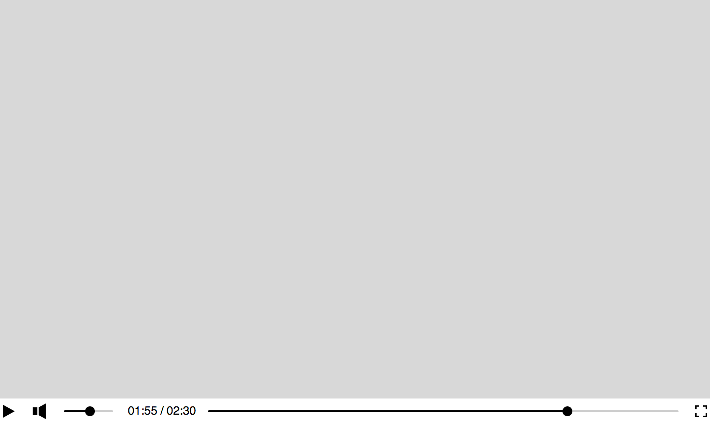

# Themes

Themes in Media.js are simple CSS.

## Default Theme

Media.js ships with a default theme that you may use as a starting point to build your own.



```js
import "mediajs/default.css";
```
